# AFM Toolbox

Atomic force microscopy (AFM) probes surfaces and nanoscale interactions by monitoring the motion of a mechanical resonator carrying a sharp tip. In dynamic, non-contact AFM—particularly frequency-modulation AFM (FM-AFM)—the resonator oscillates close to its resonance frequency while tip-sample forces modify its static deflection, frequency, amplitude, phase, and energy dissipation. Quantitative interpretation of these observables requires a consistent description of the resonator dynamics, the spatial averaging caused by its finite oscillation amplitude, and the reconstruction of the underlying interaction forces.

The **AFM Toolbox** provides the mathematical and numerical tools needed for this analysis. It supports the forward problem—calculating AFM observables from model interactions—as well as the inverse problem of reconstructing conservative forces and interaction potentials from measured frequency-shift data. The theoretical framework follows H. Söngen et al., *Quantitative atomic force microscopy*, J. Phys. Condens. Matter 29, 274001 (2017) ([DOI: 10.1088/1361-648X/aa6f8b](https://doi.org/10.1088/1361-648X/aa6f8b)). Force deconvolution is based on J. E. Sader and S. P. Jarvis, *Accurate formulas for interaction force and energy in frequency modulation force spectroscopy*, Appl. Phys. Lett. 84, 1801 (2004) ([DOI: 10.1063/1.1667267](https://doi.org/10.1063/1.1667267)).


The toolbox was originally developed in MATLAB. This implementation is deprecated and retained only for historical reference. Active development takes place in Python within the `afm_toolbox` project, whose interfaces are imported as `qafm` in the examples. This wiki documents the Python implementation.

The toolbox implements the mathematical functions for AFM, separated into **Interaction Laws** (`ForceModels.py`), **AFM theory** (`q_afm.py`), and **Force deconvolution** (`q_afm_invert.py`).
The documentation is organized into the following chapters:

- [Interaction Laws](#interaction-laws) introduces analytical force and force-gradient models, predefined interaction combinations, and the flexible construction of combined force models.
- [AFM theory](#afm-theory) derives the equations that connect the tip-sample interaction to the motion and experimentally accessible signals of the resonator.
- [Harmonic Oscillator](#harmonic-oscillator) describes the resonator transfer function, amplitude and phase response, resonance frequency, and fitting routines.
- [Coordinate Systems](#coordinate-systems) defines the tip-sample, piezo, and analysis axes required for an unambiguous interpretation of AFM data.
- [Averaging functions](#averaging-functions) introduces the cup and cap averages that account for sampling of the interaction over one oscillation cycle.
- [AFM Observables and Solvers](#afm-observables-and-solvers) relates physical interaction parameters, measured observables, and sensor parameters, and presents the available numerical solvers.
- [Force Deconvolution](#force-deconvolution) explains how conservative forces and interaction potentials are reconstructed from frequency-shift or cap-averaged force-gradient data.
- [Helper Functions](#helper-functions) summarizes frequently used conversions and utilities for AFM calculations.

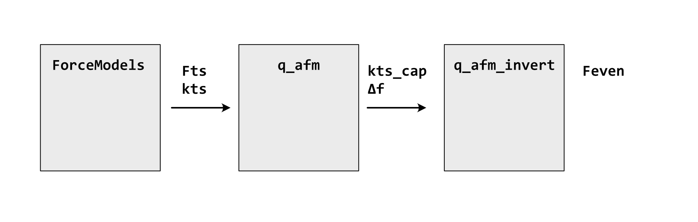

*Figure: Structure of the AFM Toolbox and its main functional areas.*

<a id="interaction-laws"></a>

## Interaction Laws

Representative force and force-gradient models are organized by their physical origin. In the legacy implementation, they are defined in `ForceModels.py`; the current Python API exposes them through `qafm.interactions`.

The force laws and their gradients are defined analytically. Legacy functions expect the $z_{\text{ts}}$ axis (see [Coordinate Systems](#coordinate-systems)), the optional velocity $\dot{z}_{\text{ts}}$, and a `model_par` dictionary containing model and AFM sensor parameters. Default parameters for this interface are available through `ForceModels.DefaultParameters()`. The current API instead uses dedicated parameter classes, as demonstrated below.

The examples show how to calculate individual tip-sample force contributions, use predefined custom force combinations, and construct flexible combined force models from callable force and gradient functions. All models are evaluated on a tip-sample distance axis `z_ts`.

### Individual Forces

The basic force and force gradient models can be evaluated separately. The following examples include chemical interactions, electrostatic forces, and several van der Waals geometries. 

```python
import numpy as np
import qafm

z_ts = np.linspace(0.01e-9, 10e-9, 10_000)
```

```python
# chemical forces
morse_par = qafm.interactions.chemical.MorseParameters(
    kappa = 2.5*(1/1e-9), sigma0 = 0.85e-9, ebond = 4.6e-21)
morse_force = qafm.interactions.chemical.morse_force(
    z_axis=z_ts, model_par=morse_par)

lj_params = qafm.interactions.chemical.LennardJonesParameters(
    sigma_tip = 0.9e-9, sigma_sample = 0.9e-9,
    epsilon_tip = 4.6e-21, epsilon_sample = 4.6e-21)
lj_force = qafm.interactions.chemical.lennard_jones_force(
    z_axis=z_ts, model_par=lj_params)
```

```python
# electrostatic forces
elstatic_params = qafm.ParameterSet([
    qafm.interactions.electrostatic.ElectrostaticParameters(
        tip_area=5e-9 * 5e-9,           # m^2
        vbias=1.0,                      # V
        eps_r=1.0e-9                    # unitless
    ),
])
elstatic_parallel_plates = qafm.interactions.electrostatic.parallel_plates_force(
    z_axis=z_ts, model_par=elstatic_params)
elstatic_sphere_plane = qafm.interactions.electrostatic.sphere_plane_force(
    z_axis=z_ts)
```

```python
# van der Waals forces
params = qafm.interactions.vdw.VdwParameters(
    H=357.619e-21,
    Theta=29.7,       # degree
    R=5e-9,
    zoffset=583.04e-12,
)
forces = {    
    "cone": qafm.interactions.vdw.cone_force(z_ts, params),
    "cone sphere": qafm.interactions.vdw.cone_sphere_force(z_ts, params),
    "cone integrated": qafm.interactions.vdw.cone_integrated_force(z_ts, params),
    "truncated cone": qafm.interactions.vdw.truncated_cone_force(z_ts, params),
    "spherical cap cone": \
        qafm.interactions.vdw.spherical_cap_cone_force(z_ts, params),
    "spherical cap cone geom.": \
        qafm.interactions.vdw.spherical_cap_cone_geometric_force(z_ts, params),
}
```

<table>
<tr>
<td>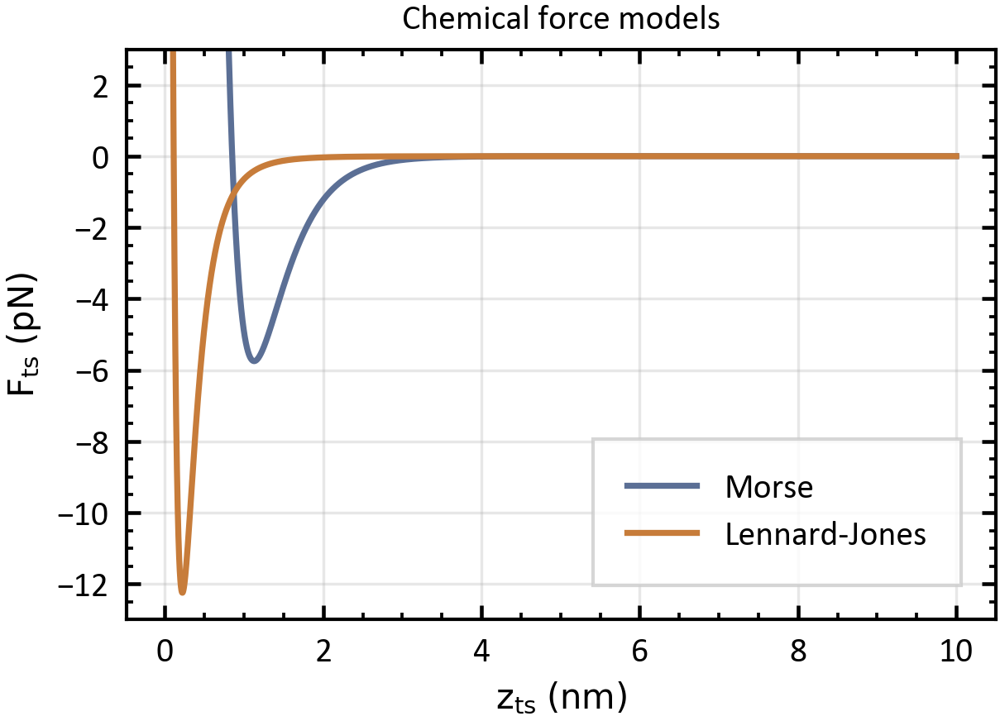</td>
<td>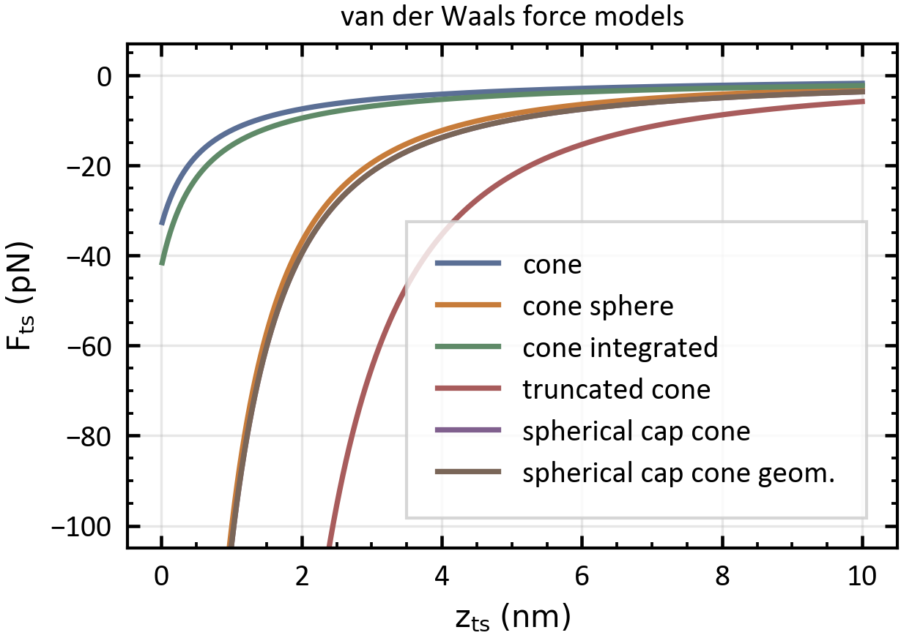</td>
</tr>
</table>

*Figure: Examples of individual chemical and van der Waals interaction forces.*

### Custom Forces

Predefined custom force models combine multiple physical interactions in one model function. The following examples combine a Morse-type chemical interaction with van der Waals contributions for different tip geometries and calculate both the resulting force and its gradient.

```python
from qafm.interactions.custom import *

c1_force = morse_vdw_cone_force(
    z_axis=z_ts,
    morse_par=qafm.interactions.chemical.MorseParameters(),
    vdw_par=qafm.interactions.vdw.VdwParameters(),
)
c1_gradient = morse_vdw_cone_forcegradient(
    z_axis=z_ts,
    morse_par=qafm.interactions.chemical.MorseParameters(),
    vdw_par=qafm.interactions.vdw.VdwParameters(),
)
c2_force = morse_vdw_cone_sphere_force(
    z_axis=z_ts,
    morse_par=qafm.interactions.chemical.MorseParameters(),
    vdw_par=qafm.interactions.vdw.VdwParameters(),
)
c2_gradient = morse_vdw_cone_sphere_forcegradient(
    z_axis=z_ts,
    morse_par=qafm.interactions.chemical.MorseParameters(),
    vdw_par=qafm.interactions.vdw.VdwParameters(),
)
```

<table>
<tr>
<td>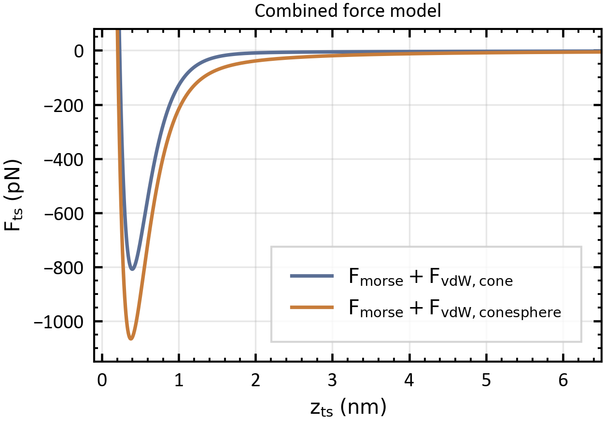</td>
<td>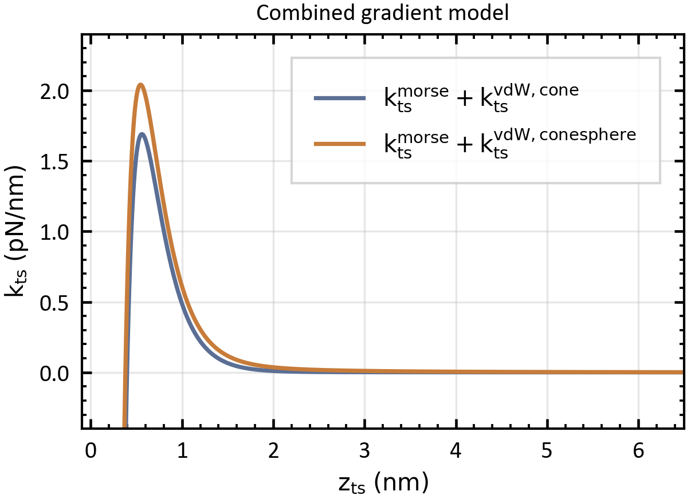</td>
</tr>
</table>

*Figure: Predefined custom force models combining chemical and van der Waals interactions.*

### Combined Forces

The `CombinedForce` interface provides a flexible alternative to predefined custom models. Individual force and gradient functions are supplied as callables and summed internally. Model-specific parameters can be attached to each function using `functools.partial`.

```python
# parameters for the combined forces
vdw_par = qafm.interactions.vdw.VdwParameters(R=20e-9)
morse_par = qafm.interactions.chemical.MorseParameters()

# single forces
vdw_force = qafm.interactions.vdw.cone_sphere_force(z_ts, vdw_par)
vdw_force_2 = qafm.interactions.vdw.cone_sphere_force(
    z_ts, model_par=vdw_par)

# combined force model with custom parameters
combined_model = qafm.interactions.combined.CombinedForce(
    forces=(
        partial(qafm.interactions.vdw.cone_sphere_force,
                model_par=vdw_par),
        partial(qafm.interactions.chemical.morse_force,
                model_par=morse_par),
    ),
    gradients=(
        partial(qafm.interactions.vdw.cone_sphere_forcegradient,
                model_par=vdw_par),
        partial(qafm.interactions.chemical.morse_forcegradient,
                model_par=morse_par),
    ),
    zero_for_negative_z=True,
)

combined_force = combined_model.force(z_ts)
combined_gradient = combined_model.gradient(z_ts)
```

<a id="afm-theory"></a>

## AFM theory

In an AFM experiment, the tip is attached to a mechanical resonator, such as a cantilever, tuning fork, or length-extension sensor. The resonator is modeled as a harmonic oscillator with effective mass $m$, spring constant $k$, and damping constant $\gamma$. Equivalently, it can be characterized by $k$, its eigenfrequency

$$
f_0
=
\frac{1}{2\pi}\sqrt{\frac{k}{m}},
$$

and its quality factor

$$
Q = \frac{\sqrt{km}}{\gamma}.
$$

The implementation of the harmonic oscillator in the AFM toolbox is described in [Harmonic Oscillator](#harmonic-oscillator). Within the harmonic approximation, the resonator deflection and tip-sample distance are

$$
\begin{aligned}
q(t)
&=
q_{\text{s}}
+
A\cos\left(2\pi f_{\text{exc}}t+\varphi\right), \\
z_{\text{ts}}(t)
&=
z_{\text{c}}
+
A\cos\left(2\pi f_{\text{exc}}t+\varphi\right),
\end{aligned}
$$

and the tip velocity is given by

$$
\dot{z}_{\text{ts}}
=
-2\pi f_{\text{exc}} A
\sin\left(2\pi f_{\text{exc}}t + \varphi\right).
$$

Here, $q_{\text{s}}$ is the static deflection, $A$ the oscillation amplitude, $f_{\text{exc}}$ the excitation frequency, and $\varphi$ the phase shift. The center position of the tip oscillation is denoted by $z_{\text{c}}$. A precise description of the tip oscillation in the context of AFM and the tip-sample interaction requires the definition of several $z$ axes, which are described in [Coordinate Systems](#coordinate-systems).

The tip motion is governed by the equation of motion of the driven damped harmonic oscillator:

<a id="oscillator-equation"></a>

$$
m\ddot{q}
=
F_{\text{ts}}
\left(
z_{\text{ts}},
\dot{z}_{\text{ts}}
\right)
+
F_0\cos\left(2\pi f_{\text{exc}}t\right)
-
kq
-
\gamma\dot{q}.
$$

Here, $F_{\text{ts}}$ denotes the force exerted by the sample on the tip. The tip-sample force can generally depend on both the tip-sample distance $z_{\text{ts}}$ and the tip velocity $\dot{z}_{\text{ts}}$, and can be classified as either even or odd with respect to the tip velocity:

$$
F_{\text{ts}}
\left(
z_{\text{ts}},
\dot{z}_{\text{ts}}
\right)
=
F_{\text{even}}
\left(
z_{\text{ts}},
\dot{z}_{\text{ts}}
\right)
+
F_{\text{odd}}
\left(
z_{\text{ts}},
\dot{z}_{\text{ts}}
\right).
$$

Even and odd forces satisfy the following symmetry relations:

$$
\begin{aligned}
F_{\text{even}}
\left(
z_{\text{ts}},
\dot{z}_{\text{ts}}
\right)
&=
F_{\text{even}}
\left(
z_{\text{ts}},
-\dot{z}_{\text{ts}}
\right), \\
F_{\text{odd}}
\left(
z_{\text{ts}},
\dot{z}_{\text{ts}}
\right)
&=
-
F_{\text{odd}}
\left(
z_{\text{ts}},
-\dot{z}_{\text{ts}}
\right).
\end{aligned}
$$

The even and odd force components contribute to different time-averaged quantities: the even component is related to the time-averaged kinetic energy, whereas the odd component determines the time-averaged power transfer. Conservative forces contribute exclusively to the even component, while non-conservative forces may, in general, contribute to both the even and odd components.

Introducing the tip-sample force gradient $k_{\text{ts}}$ and the tip-sample damping coefficient $\gamma_{\text{ts}}$ as

$$
\begin{aligned}
k_{\text{ts}}
\left(z_{\text{ts}},\dot{z}_{\text{ts}}\right)
&=
\frac{
\partial F_{\text{even}}
\left(z_{\text{ts}},\dot{z}_{\text{ts}}\right)
}{
\partial z_{\text{ts}}
}, \\
F_{\text{odd}}
\left(z_{\text{ts}},\dot{z}_{\text{ts}}\right)
&=
-\gamma_{\text{ts}}
\left(z_{\text{ts}},\dot{z}_{\text{ts}}\right)
\dot{z}_{\text{ts}},
\end{aligned}
$$

the experimentally accessible quantities within the harmonic approximation are weighted averages over the interval $[z_{\text{c}}-A,z_{\text{c}}+A]$, as further shown in [Averaging functions](#averaging-functions). The three AFM equations connect the measured quantities to the weighted cup and cap averages:

$$
\begin{aligned}
\left\langle
F_{\text{even}}
\left(z_{\text{ts}},\dot{z}_{\text{ts}}\right)
\right\rangle_{\cup}
&=
kq_{\text{s}}, \\
\left\langle
k_{\text{ts}}
\left(z_{\text{ts}},\dot{z}_{\text{ts}}\right)
\right\rangle_{\cap}
&=
k\left[
1-
\left(
\frac{f_{\text{exc}}}{f_0}
\right)^2
\right]
-
\frac{F_0}{A}\cos\varphi, \\
\left\langle
\gamma_{\text{ts}}
\left(z_{\text{ts}},\dot{z}_{\text{ts}}\right)
\right\rangle_{\cap}
&=
-\frac{k}{2\pi f_0Q}
-
\frac{F_0}{2\pi f_{\text{exc}}A}\sin\varphi.
\end{aligned}
$$

Quantitative AFM distinguishes between weighted averages of physical parameters, experimental observables, and sensor parameters. The conversion between the measured observables and the weighted averages of the physical parameters is described in [AFM Observables and Solvers](#afm-observables-and-solvers). The three AFM equations can be solved for the weighted averages of the physical parameters using different solvers, as described in that section. The interaction force $F_{\text{even}}$ and the interaction potential $U_{\text{even}}$ can be reconstructed from the measured observable $\langle k_{\text{ts}} \rangle_{\cap}$; suitable reconstruction algorithms are described in [Force Deconvolution](#force-deconvolution).

<a id="harmonic-oscillator"></a>

## Harmonic Oscillator

AFM is based on an externally excited, damped harmonic oscillator. The transfer function $G_{\text{ho}}$ determines the amplitude and phase response to a given harmonic excitation signal. It can be evaluated using the following functions:

- `q_afm.Gho(fexc, mp)`: complex transfer function of a damped harmonic oscillator.
- `q_afm.Gho_A(fexc, mp)`: amplitude of the transfer function.
- `q_afm.Gho_phi(fexc, mp)`: phase of the transfer function.
- `q_afm.f_resonance(mp)`: resonance frequency for a given eigenfrequency and quality factor.

The sensor parameters are provided via the dictionary `mp`:

```python
mp = {"k0": k0, "f0": f0, "Q0": Q0, "A0": A0}
```

Example data can be plotted using `q_afm.example_plots_Gho()`.

<table>
    <tr>
        <td align="center">
            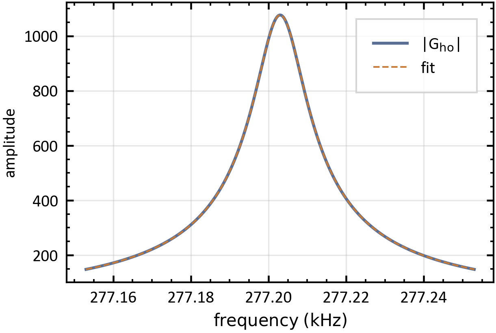
        </td>
        <td align="center">
            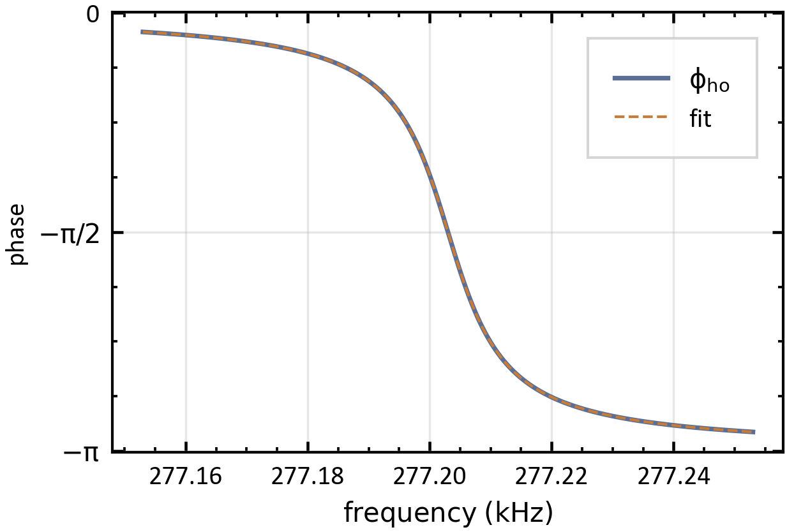
        </td>
    </tr>
</table>

*Figure: Oscillator transfer function.*

A fit to experimental data for determining the oscillation parameters can be performed with `q_afm.Gho_fit`. Note that the returned parameter `k0` is not necessarily the spring constant unless the system has been properly calibrated.

<a id="coordinate-systems"></a>

## Coordinate Systems

A precise description of AFM signals requires the definition of several axes:

| Symbol | Definition | Description |
|---|---|---|
| $z_{\text{ts}}$ | Tip-sample distance | Distance between tip and sample, referenced to the sample surface. |
| $z_{\text{p}}$ | Piezo position | Position of the piezo. Experimental data are acquired with respect to this axis. |
| $z_{\text{tip}}$ | Tip position used for data analysis | Data analysis axis that has an unknown offset $\delta z_0$ with respect to the tip-sample axis. |

*Table: Coordinate systems used in AFM signal analysis.*

An illustration of the different $z$ axes and coordinates is shown in the following figure:

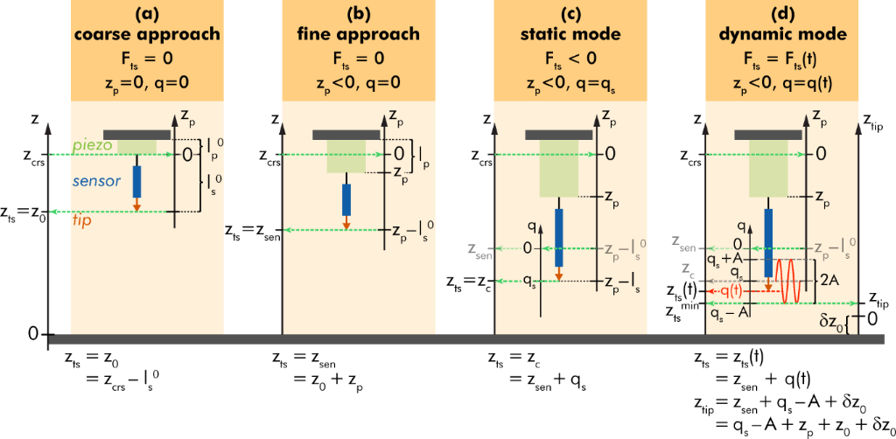

*Figure: AFM coordinate systems. Source: P. Rahe et al., Beil. J. Nanotech. 13, 610 (2022), [DOI: 10.3762/bjnano.13.53](https://doi.org/10.3762/bjnano.13.53).*

<a id="averaging-functions"></a>

## Averaging functions

Within the harmonic approximation, the tip samples the force field along one oscillation path. Therefore, the experimentally accessible quantities are weighted averages over the interval $[z_{\text{c}}-A,z_{\text{c}}+A]$.

The cup average is defined as

$$
\left\langle f^\circ \right\rangle_{\cup}(z_{\text{c}})
=
\int_{-A}^{+A}
f^\circ(z_{\text{c}}+z)
w_{\cup}(z)
\,\mathrm{d}z,
$$

with

$$
w_{\cup}(z)
=
\frac{1}{\pi\sqrt{A^2-z^2}}.
$$

The cap average is defined as

$$
\left\langle f^\circ \right\rangle_{\cap}(z_{\text{c}})
=
\int_{-A}^{+A}
f^\circ(z_{\text{c}}+z)
w_{\cap}(z)
\,\mathrm{d}z,
$$

with

$$
w_{\cap}(z)
=
\frac{2}{\pi A^2}
\sqrt{A^2-z^2}.
$$

<table>
<tr>
<td>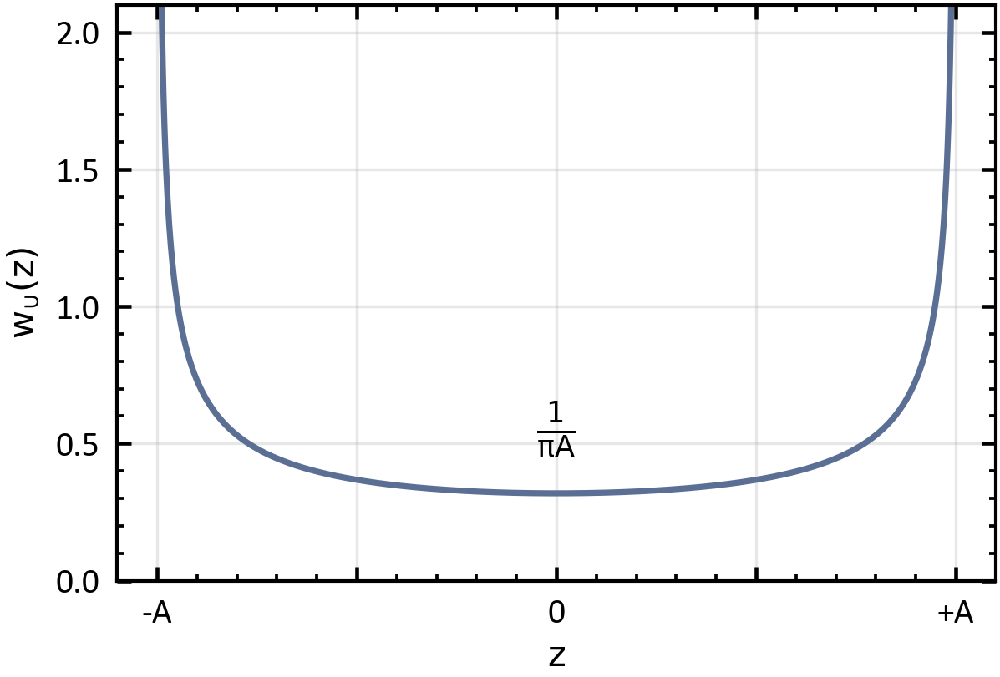</td>
<td>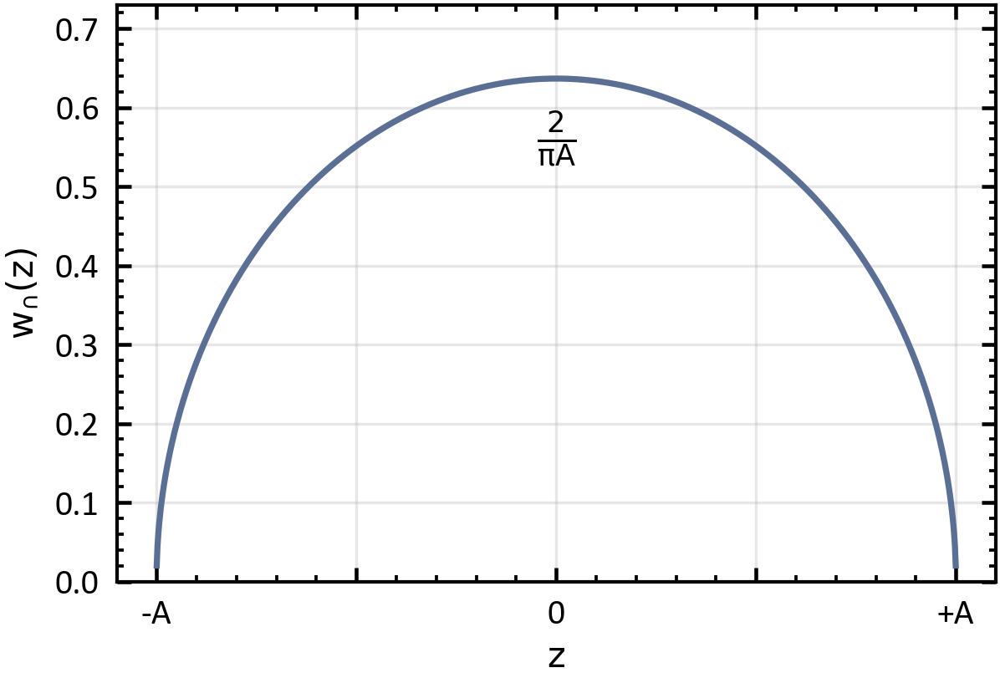</td>
</tr>
</table>

*Figure: Averaging functions for AFM data.*

<a id="afm-observables-and-solvers"></a>

## AFM Observables and Solvers

**Quantitative AFM** distinguishes between weighted averages of physical parameters, experimental observables, and sensor parameters:

| Weighted averages of physical parameters | Experimental observables | Sensor parameters |
|---|---|---|
| $\langle F_{\text{even}} \rangle$ | $q_{\text{s}}$ | $k_0$ |
| $\langle F_{\text{odd}} \rangle$ | $A$ | $Q_0$ |
|  | $f_{\text{exc}}$ | $f_0$ |
|  | $F_0$ |  |
|  | $\varphi$ |  |

*Table: Main quantities used in quantitative AFM.*

Dynamic AFM in the harmonic approximation can determine three quantities of the tip-sample interaction:

- $F_{\text{even}}^\circ$
- $k_{\text{even}}^\circ$
- $\gamma_{\text{ts}}^\circ$

The key measurement observables are the cup- and cap-averaged quantities:

- $\left\langle F_{\text{even}}^\circ \right\rangle_{\cup}$
- $\left\langle k_{\text{even}}^\circ \right\rangle_{\cap}$
- $\left\langle \gamma_{\text{ts}}^\circ \right\rangle_{\cap}$

For efficiency and flexibility, several versions of the averaging functions are implemented. All versions are accessible via the central functions:

- `q_afm.wcup(z_axis, feq, A0)`
- `q_afm.wcap(z_axis, feq, A0)`

Depending on the properties of `z_axis` and the type of `feq`, different implementations are called internally:

- `wcup_callable(z_axis, feq, A0)` and `wcap_callable(z_axis, feq, A0)` are used if `feq` is a callable object, for example a function. Integration is performed using `scipy.integrate.quad`.
- `wcup_equiz(z_axis, feq, A0)` and `wcap_equiz(z_axis, feq, A0)` are used if `feq` is a NumPy array and `z_axis` is equidistant.
- `wcup_nonequiz(z_axis, feq, A0)` and `wcap_nonequiz(z_axis, feq, A0)` are used if `feq` is a NumPy array and `z_axis` is not equidistant. This implementation is slower than the equidistant variant.

The averaging functions are tested using the `ForceModels.Fts_Morse_vdWF3` and `ForceModels.kts_Morse_vdWF3` equations. The results can be plotted by calling `q_afm.example_plots_wcupwcap()`.

Different **solvers** are implemented to calculate the measurement observables from the force interactions for different modes and levels of approximation:

- `fmmode_smallA(z_p, ktsfunc, model_par)`: small-amplitude approximation. This solver does not perform convolution and assumes $q_{\text{s}} = 0$. It uses $\Delta f \approx -\frac{f_0}{2k_0}k_{\text{ts}}(z)$.
- `fmmode_approx(z_p, ktsfunc, model_par)`: assumes $q_{\text{s}} = 0$ and performs a convolution to calculate $\langle k_{\text{ts}} \rangle_{\cap}$.
- `fmmode_itersolve(z_p, Fts, kts, gammats, model_par, maxIter)`: iterative solution within the harmonic approximation, including the static deflection.
- `fmmode_fsolve(z_p, Fts, kts, gammats, model_par, debug)`: uses `scipy.optimize.fsolve` to solve the AFM equations.

<a id="force-deconvolution"></a>

## Force Deconvolution

The interaction force $F_{\text{even}}^\circ$ and the interaction potential $U_{\text{even}}^\circ$ can be reconstructed from the measured observable `kts_cap` under the following assumptions:

- Only even forces are present.
- $q_{\text{s}} = 0$.
- Force and potential are zero at the largest sampled value of $z_{\text{p}}$.

Suitable reconstruction algorithms are implemented in `qafm.inversion`. The Sader–Jarvis deconvolution approach is implemented in `Feven_deconv()`, and the matrix method is implemented in `Feven_matrix_deconv()`.

```text
Feven_deconv(zk, ktscap, A0, sgwin, sgdegree, tozero)
Feven_matrix_deconv(zk, ktscap, A0, tozero, spacing_tolerance)
Feven_deconv_iterative()  # not implemented yet
```

The following example in the Python code and the figure below demonstrates the convolution and deconvolution workflow in `qafm`.

```python
import qafm

zk, kts = qafm.numerics.differentiation.numdiff(
    z_axis, model_force, order=1, method="gradient"
)
zc, ktscap = qafm.averaging.wcap(
    zk, kts, A0=sensor.A0
)
df = qafm.fm.conversions.ktscap_to_df_approx(
    ktscap=ktscap, model_par=sensor
)
zFeven, Feven = qafm.inversion.df_to_force_curve(
    z=zc, df=df, sensor=sensor, tozero=False
)
ktsevencap = qafm.fm.conversions.df_to_ktscap(
    df, sensor
)
zFeven_matrix, Feven_matrix = qafm.inversion.Feven_matrix_deconv(
    zk=zc, ktscap=ktsevencap, A0=sensor.A0
)
```

The model tip-sample force from [Interaction Laws](#interaction-laws) is used, which combines a van der Waals and Lennard-Jones interaction. The force is numerically differentiated to obtain the force gradient, which is then cap-averaged to simulate the measured FM-AFM observable. From the resulting frequency shift, the conservative force is reconstructed by deconvolution and compared with the original model force.

<table>
    <tr>
        <td>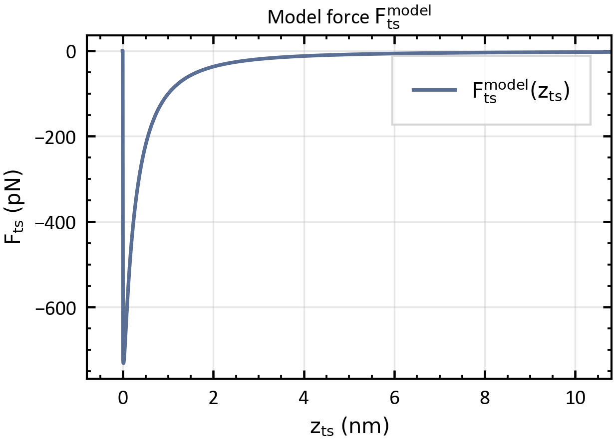</td>
        <td>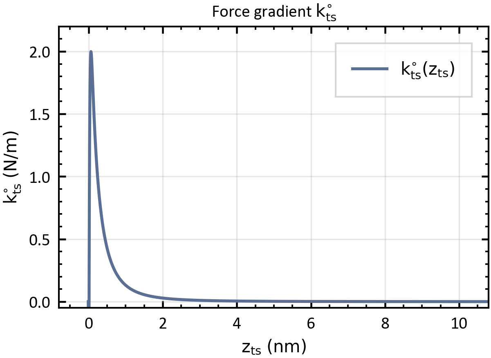</td>
    </tr>
    <tr>
        <td>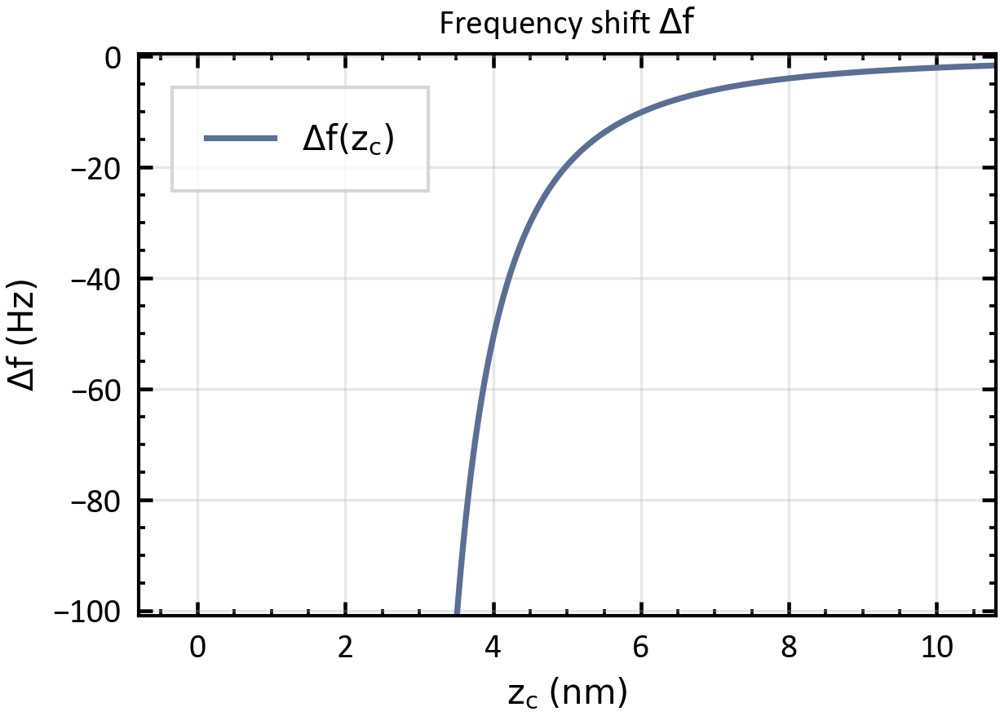</td>
        <td>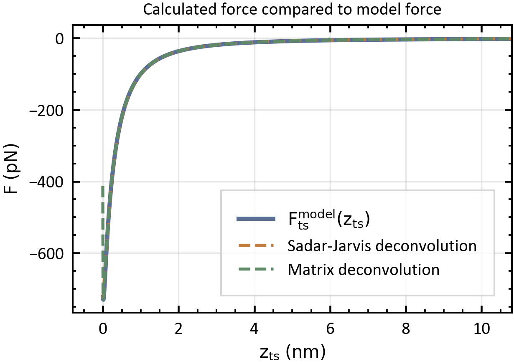</td>
    </tr>
</table>

*Figure: Example procedure for convolution and deconvolution with a model tip-sample force.*

The algorithms use Savitzky–Golay filters implemented in `savgolfilter.py` to calculate derivatives. For equidistant data along $z$, `scipy.signal.savgol_filter` is used. For non-uniform data along $z$, a custom implementation is used.

<a id="helper-functions"></a>

## Helper Functions

Several helper functions are provided to handle common AFM theory calculations efficiently:

- `q_afm.ktscap_to_df_approx`: calculates $\Delta f$ from the approximation

  $$
  \left\langle k_{\text{ts}}^\circ \right\rangle_{\cap}
  \approx
  -\frac{2k_0}{f_0}\Delta f.
  $$

  This approximation results from a Taylor expansion and is robust for $f_{\text{exc}} - f_0 \ll f_0$.

- `q_afm.ktscap_to_fexc`: calculates $f_{\text{exc}}$ from $\langle k_{\text{ts}} \rangle_{\cap}$ for the FM case with $\varphi = -\pi/2$.

- `q_afm.fexc_to_ktscap`: calculates $\langle k_{\text{ts}} \rangle_{\cap}$ from $f_{\text{exc}}$ for the FM case with $\varphi = -\pi/2$.

- `q_afm.df_to_ktscap`: same as `q_afm.fexc_to_ktscap`, but using $\Delta f = f_{\text{exc}} - f_0$ as input.

- `q_afm.fexc_to_df`: calculates $\Delta f = f_{\text{exc}} - f_0$.

- `q_afm.q_t`: returns the time series of the deflection $q(t)$ in the harmonic approximation.
